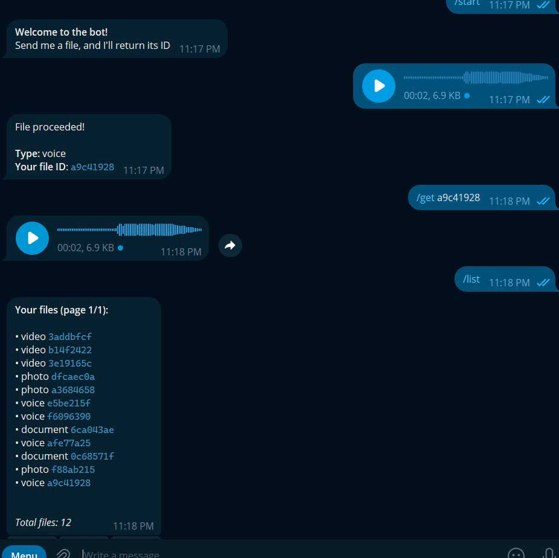

# FileVaultBot - Telegram File Management Bot

A Telegram bot that allows users to store and retrieve files using unique IDs - all within the Telegram ecosystem. FileVaultBot acts as a smart vault: it stores references to your files in Telegram's cloud, giving you quick access via short unique codes.

## How It Works

1. **Upload**: Send any file to the bot.
2. **ID Assignment**: The bot generates a unique ID and stores the file reference in the database.
3. **Retrieve**: Use `/get afe77a25` to get the file back - even from another device.
4. **Manage**: List your files anytime.

All files are stored in Telegram’s cloud; the bot only manages the mapping between your unique ID and Telegram’s `file_id`.

## Tech Stack

* **Language**: Python 3.14
* **Framework**: [aiogram 3.27](https://docs.aiogram.dev/) (async Telegram bot framework)
* **Database**: SQLite with [aiosqlite](https://pypi.org/project/aiosqlite/) (async wrapper)
* **Dependency Management**: `poetry`
* **Configuration**: Environment variables (`.env`)
* **Logging**: Built‑in `logging` module

## Commands

* `/start` - Show welcome message and instructions.
* `/get file_id` - Retrieve a file by its unique ID.
* `/list` - View your uploaded files (paginated).

## Future Roadmap
* Show file statistics by type
* Export file list as a CSV file
